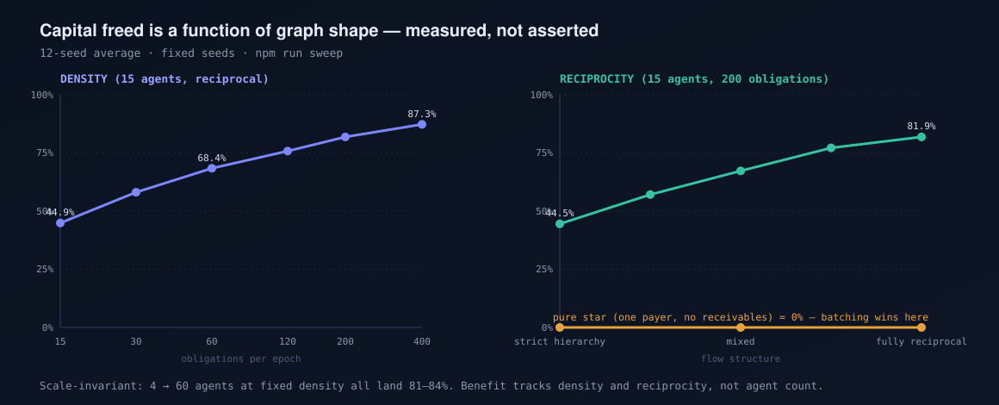

# Benchmarks, limits, and what is actually real

Every number Clearloop quotes is a point on a curve, and the curve has a floor where
Clearloop is worth nothing. This page publishes both, plus an explicit accounting of
what is running on-chain versus what is simulated.

Reproduce all of it:

```bash
npm run sweep          # the table below
npm run sweep -- --csv # machine-readable
```

Fixed seeds, 12-seed average on mesh rows. No cherry-picked graph.

---

## 1. Where Clearloop does nothing

**A pure star frees 0% of capital.** One agent paying many sellers, with no receivables
coming back, has nothing to offset. Netting the graph is a no-op, and Circle's
buyer-side batching (Nanopayments / MPP) is strictly the better tool — one signature
set, one settlement, done.

| scenario | agents | obligations | gross | net moved | capital freed |
|---|---:|---:|---:|---:|---:|
| star · 1 payer → 3 sellers | 4 | 3 | $86 | $86 | **0%** |
| star · 1 payer → 10 sellers | 11 | 10 | $350 | $350 | **0%** |
| star · 1 payer → 50 sellers | 51 | 50 | $2,461 | $2,461 | **0%** |

This is the honest bound on the whole thesis: **netting is worth exactly as much as the
obligation graph is reciprocal.** If your agents only ever spend, Clearloop adds a
coordinator and buys you nothing. Use MPP.

Clearloop earns its place when agents are *also* earning — which is the direction the
agent economy is heading, but it is an assumption, not a fact, and it is the first thing
that should be measured against real traffic.

---

## 2. Where it pays, and how much

### Reciprocity is the dominant variable

Flow structure swept from a strict hierarchy (every payment flows "downhill" by agent
index — a DAG, no cycles at all) to uniformly random pairs. 15 agents, 200 obligations.

| flow structure | gross | net moved | capital freed |
|---|---:|---:|---:|
| pure star (no receivables) | — | — | **0%** |
| strict hierarchy (acyclic) | $9,927 | $5,509 | **44.5%** |
| mostly hierarchical | $9,927 | $4,252 | 57.1% |
| mixed | $9,927 | $3,244 | 67.3% |
| mostly reciprocal | $9,927 | $2,261 | 77.2% |
| fully reciprocal | $9,927 | $1,799 | **81.9%** |

**A finding worth stating plainly:** a strict hierarchy contains *no cycles*, and netting
still frees 44.5%. So cycle-cancellation is not where most of the value comes from —
it comes from each middle agent's receivable offsetting its own payable. A 20-agent
supply chain (A→B→C→…, no cycles anywhere) frees 52.3%.

That matters for the MPP comparison: you don't need exotic circular trade for
multilateral netting to beat per-payer batching. You only need agents that both receive
and pay.

### Density

15 agents, reciprocal flow, obligations per epoch swept:

| obligations | gross | net moved | settlements | capital freed |
|---:|---:|---:|---:|---:|
| 15 | $772 | $422 | 12 | 44.9% |
| 30 | $1,459 | $611 | 13 | 58.1% |
| 60 | $2,919 | $926 | 14 | 68.4% |
| 120 | $5,925 | $1,433 | 14 | 75.8% |
| 200 | $9,927 | $1,799 | 14 | 81.9% |
| 400 | $19,980 | $2,545 | 14 | **87.3%** |

More traffic per epoch → more offsetting. Longer epochs trade settlement latency for
capital efficiency, and that is the actual tuning knob an operator has.

### Agent count barely matters

At a fixed ~13 obligations per agent:

| agents | obligations | capital freed |
|---:|---:|---:|
| 4 | 52 | 84.1% |
| 8 | 104 | 82.2% |
| 15 | 195 | 81.4% |
| 30 | 390 | 81.4% |
| 60 | 780 | 81.5% |

**Scale-invariant.** The benefit tracks density and reciprocity, not how many agents are
in the pool. A four-agent pool with real two-way flow beats a sixty-agent pool of
one-way spenders.



---

## 3. Real vs simulated

Written before anyone asks.

| Component | Status | Detail |
|---|---|---|
| ClearingHouse + CreditRegistry contracts | **REAL** | Deployed on Arc testnet, verified addresses below |
| Net settlement on-chain | **REAL** | `settleEpoch` transactions on ArcScan, gas paid in USDC |
| EIP-712 obligation signatures | **REAL** | Signed off-chain, recovered and verified on-chain in `settleEpoch` |
| Netting engine | **REAL** | Pure TS, 5 unit tests; mirrors the Solidity so off-chain and on-chain agree |
| Contract test suite | **REAL** | 10 Foundry tests incl. credit draw, over-limit, reserve shortfall, repay, liquidate |
| x402 payment flow | **REAL protocol, LOCAL peers** | Genuine HTTP 402 round-trips with signed payloads; the seller agents are local processes, not remote third parties |
| Credit facility | **REAL mechanism, SEEDED inputs** | Draw/repay/liquidate all execute on-chain; the credit *limit* is owner-set, not yet derived from settlement history |
| Agent decision-making | **SIMULATED** | Agents follow scripted buy/sell patterns. No LLM in the loop |
| Obligation graphs | **SIMULATED** | Synthetic, seeded generators — no real agent payment traffic exists to sample yet |
| Capital-freed percentages | **MEASURED on simulated graphs** | Reproducible sweep above; honest about the input being synthetic |
| USDC | **REAL on Arc** | Native gas token, system address `0x3600…0000`. `MockUSDC` is used **only** in local tests |

### What would falsify the thesis

If real agent payment traffic turns out to be predominantly star-shaped — agents that
spend but rarely earn — the measured benefit collapses toward 0% and buyer-side batching
is sufficient. That is the experiment to run next, and it needs traffic Clearloop does
not have yet.

---

## Deployed on Arc testnet (chain 5042002)

| Contract | Address |
|---|---|
| ClearingHouse | `0xe8e5adC9054eFFf87c4334596695176cA1d56fe2` |
| CreditRegistry | `0xB9940fb40194Cd9De3E4467286698cc92118eA7f` |
| USDC (native) | `0x3600000000000000000000000000000000000000` |

Explorer: [testnet.arcscan.app](https://testnet.arcscan.app)
