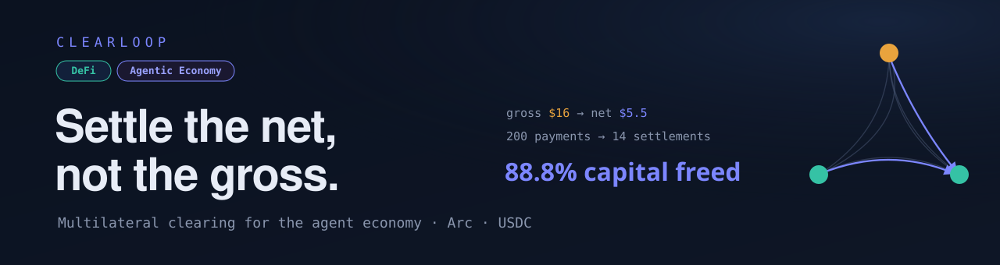

<p align="center">
  
</p>

<p align="center">
  &nbsp;
  &nbsp;
  
</p>

<p align="center">
  <b><a href="https://clearloop-makabeezs-projects.vercel.app">▶ Live demo</a></b> &nbsp;·&nbsp;
  <a href="https://testnet.arcscan.app/address/0xe8e5adC9054eFFf87c4334596695176cA1d56fe2">ClearingHouse on Arc</a> &nbsp;·&nbsp;
  <a href="BENCHMARKS.md">Benchmarks &amp; honest limits</a>
</p>

**Multilateral clearing for the agent economy — settle the net, not the gross.** Autonomous agents are buyers *and* sellers at once, so their mutual obligations form a graph, not a line. Clearloop offsets every agent's receivables against its payables across that graph and settles only net USDC on Arc — freeing the working capital that per-payer batching leaves locked.

This is the app repo (netting engine, coordinator, agents, UI). Contracts live in [`clearloop-kit`](https://github.com/Makabeez/clearloop-kit).

## Run

```bash
npm install
npm test        # 5 tests: cyclic graph nets to zero, bilateral offset, conservation, dense-graph savings
npm run demo    # generate a dense agent graph and print the capital-freed headline
```

Example `npm run demo` output — 15 agents, 200 obligations:

```
  gross volume .......... $9376
  net volume moved ...... $1047
  settlements ........... 14   (vs 200 gross payments)
  capital freed ......... 88.8%
```

Tune with `AGENTS=20 EDGES=300 SEED=7 npm run demo`.

## On-chain end-to-end

Runs the whole cycle against a real chain: deploy → fund agents → agents sign obligations → coordinator nets → `settleEpoch` on-chain → decoded result.

**Local (anvil):** in one terminal `anvil`; in another:

```bash
npm run e2e
```

Example output — 5 signed obligations settled in one tx:

```
  gross volume ...... $155
  net moved ......... $25
  obligations ....... 5   →   settlements 2
  capital freed ..... 83.9%
  tx ................ 0x67f5...c6c7
  cleared balances:  Alice $75   Bob $110   Carol $115
```

**Arc testnet:** copy `.env.example` to `.env`, fill in RPC/USDC/ClearingHouse/keys, then `npm run e2e` — same command, no code change. Deploy the contract first from the kit: `forge script script/Deploy.s.sol --rpc-url $ARC_RPC --private-key $DEPLOYER_KEY --broadcast`.

**Coordinator service** (agents POST obligations over the network):

```bash
CLEARINGHOUSE_ADDRESS=0x... DEPLOYER_KEY=0x... npm run coordinator
# POST /obligations  {debtor,creditor,amount,nonce,epochId,signature}
# POST /settle       {epochId}   -> nets the pool, submits one epoch, returns tx + batch
```

## x402 — agents paying agents

Clearloop speaks x402 (the same HTTP-402 negotiation standard Circle Nanopayments uses). Circle ships the `GatewayWalletBatched` scheme, which batches on the *buyer* side; Clearloop registers a sibling scheme, `clearloop-exact`, using the same EIP-712 / EIP-3009-shaped authorization — but the payloads clear **multilaterally** across the agent graph. Same rail family, one layer up.

Each agent runs a paywalled service and buys from the others. Every purchase is a signed obligation that drops into the netting graph:

```bash
npm run x402
```

```
  Alice → Bob    $1.5  price-feed
  Bob   → Carol  $3    compute
  Carol → Alice  $2    risk-score
  ...
  gross $16 → net $5.50 · 65.6% freed · 2 settlements
```

The same signed obligations settle on Arc via `npm run e2e`. Productionization: sign the payload as an EIP-3009 `TransferWithAuthorization` so one signature is redeemable by either Circle Gateway (buyer-side) or Clearloop (multilateral) — see `src/x402.ts`.

## Credit facility

A net-debtor can clear beyond its collateral against a reputation-priced credit line (`CreditRegistry`). The shortfall is fronted from the house reserve and recorded as debt; creditors are always paid in full. Default waterfall: `repay()` clears debt, `liquidate()` seizes a delinquent member's collateral back into the reserve.

```bash
anvil            # one terminal
npm run credit   # another
```

```
  credit drawn ...... $40   ← Dave cleared past his $10 collateral
  Dave debt ......... $40   (owed to the house)
  Alice paid full ... $130  (creditor unaffected)
  → Dave repays. debt $0 · reserve back to $100
```

## Circle Developer-Controlled Wallets

Agents hold real Circle wallets on Arc testnet and sign their obligations through
Circle's `signTypedData` endpoint — **no private key ever exists in the agent
process**. Circle custodies the key material behind an entity secret; the agent
only asks for a signature.

This fits Clearloop's architecture exactly: agents never send transactions, they
only *authorize*. The coordinator submits one net settlement. So the signing
authority is swappable and the clearing layer is untouched — a Circle-signed
obligation verifies inside `settleEpoch` byte-for-byte like a locally-signed one.

```bash
# 1. API key + entity secret from console.circle.com, into .env
npm run circle:setup     # creates a wallet set + one EOA wallet per agent on Arc
# 2. fund each printed address at https://faucet.circle.com (Arc Testnet)
npm run circle:demo      # agents sign via Circle → graph netted → settled on Arc
```

Wallets are created as **EOA, not SCA**, on purpose: `ClearingHouse.settleEpoch`
verifies with `ecrecover`, which only recovers EOA signers (an SCA would require
EIP-1271). The demo also re-verifies each Circle signature locally before
submitting, so a mismatch fails loudly instead of as an opaque revert.

Circle's own reference pattern for autonomous payments is Wallets + USDC + x402.
Clearloop uses exactly that, and adds multilateral clearing on top.

## Honest limits (read this)

**Netting frees 0% on a pure star.** One agent paying many sellers with nothing coming
back has nothing to offset — there, Circle's buyer-side batching is strictly the better
tool. Clearloop earns its place only when agents both earn and spend.

Measured, not asserted — reproduce with `npm run sweep`:

| flow structure | capital freed |
|---|---:|
| pure star (no receivables) | **0%** |
| strict hierarchy, no cycles at all | 44.5% |
| mixed | 67.3% |
| fully reciprocal | **81.9%** |

Note the second row: a graph with **no cycles** still frees 44.5%, because each middle
agent's receivable offsets its own payable. Cycle-cancellation isn't where the value is —
that's why this beats per-payer batching without needing exotic circular trade.

Full sweep, the density and scale curves, and an explicit real-vs-simulated accounting:
**[BENCHMARKS.md](BENCHMARKS.md)**.

## Visual hero

`web/index.html` — open in a browser (no build). Hit **Run clearing epoch**: the gross obligation mesh collapses into net settlement arcs, agents recolor by net position, and the ledger counts up to the capital-freed figure. Toggle **Dense · 15 agents** for the 88.8% view.

## What's here

| File | Role |
|---|---|
| `src/netting.ts` | Multilateral netting engine (the IP). Mirrors `ClearingHouse.settleEpoch`. |
| `src/obligation.ts` | EIP-712 signing (viem). Domain + types match `ClearingHouse.sol`. |
| `src/x402.ts` | The `clearloop-exact` x402 scheme — 402 terms, payload, verification. |
| `src/x402-agent.ts` | Paywalled seller agent + buyer `pay()` (the 402 round-trip). |
| `src/agent.ts` | An autonomous participant that issues signed obligations. |
| `src/coordinator.ts` | Pools obligations, submits `settleEpoch`, decodes `SettlementBatch`. |
| `src/coordinator-server.ts` | Thin HTTP coordinator (`/obligations`, `/settle`). |
| `src/chain.ts` / `src/artifacts.ts` | viem clients (env-driven, RPC backoff) + kit ABI loader. |
| `src/e2e.ts` | Full on-chain cycle — deploy / fund / settle. |
| `src/x402-demo.ts` | Agents buying from each other over x402, cleared multilaterally. |
| `src/credit-demo.ts` | Intraday credit: a thin-collateral agent clears on a credit line, then repays. |
| `src/demo.ts` | Offline console demo — the capital-freed number, no RPC. |
| `web/index.html` | Visual hero — the obligation graph collapsing gross→net. |

## Next

- [ ] Wire **`CreditRegistry`** into settlement (intraday credit for net-debtors).
- [ ] Sign obligations as EIP-3009 `TransferWithAuthorization` for one-signature Gateway/Clearloop interop.
- [ ] Autonomous agent **decision loop** tied to real price/budget signals.
